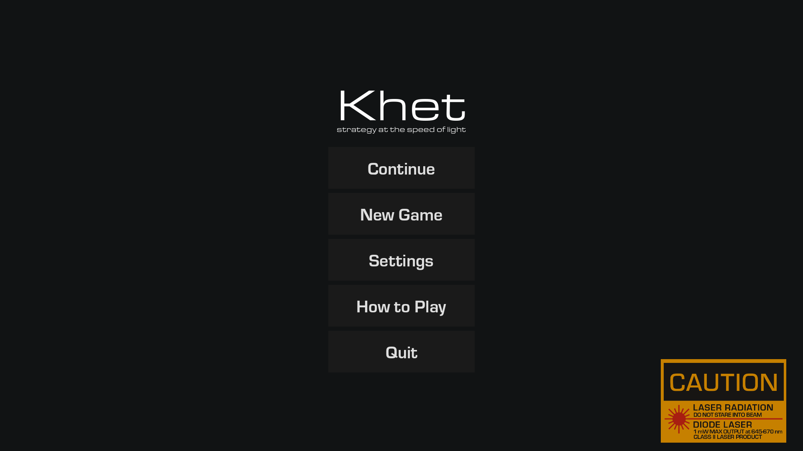
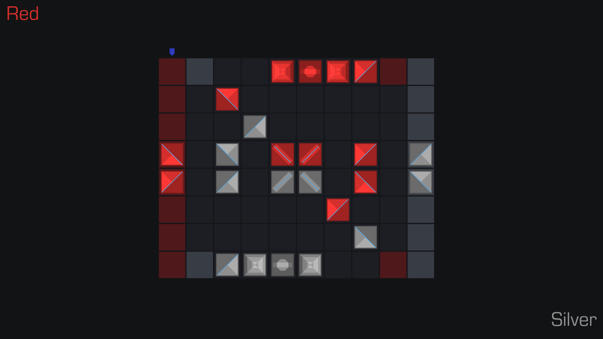
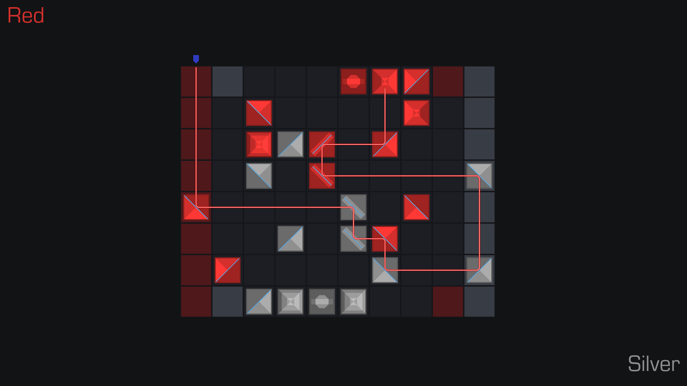

# Khet
## Strategy at the speed of light

[Khet](https://en.wikipedia.org/wiki/Khet_(game)) is a board game invented by Prof. Michael Larson and two students, Del Segura and Luke Hooper, at Tulane University. It has been presented under its original name Deflexion during the NY Toy Fair in 2005, and was later released as Khet in 2006 by the Innovention Toys. It has been discontinued since, and later in 2017 rebranded and redesigned under a soulless name of "Laser Chess" by Thinkfun, who fully stripped its original Egypt-punk aesthetic introducing generic sci-fi visual code. 

This project is an attempt to bring the original charm of Khet as a 2D game written fully in Godot.

## Disclaimer

This game is and will remain an open source project. It is distributed under a non-AI Unlicense license. At this point, this is very much a work in progress.

## To-do
- [ ] steps/player logic
- [ ] AI player
- [ ] settings menu
- [ ] game instructions menu
- [ ] HUD current score and active player display
- [x] pieces movements
- [x] basic menu
- [x] save/load functionality
- [x] laser logic